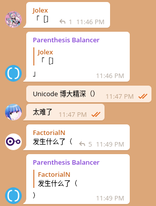

# Parenthesis Balancer

Save the world from those who broke the subtle balance of left parentheses and right parentheses.

## How It Looks Like?

## Deployment

1. `mv constants.example.js constants.js; mv wrangler.example.toml wrangler.toml`, modify the content of these two files. 
2. `wrangler publish`, login if needed. 
3. Set webhook: `curl 'https://api.telegram.org/bot<your-token>/setWebhook?url=https://<your-deployment-domain>/<your-token>'`

## Known Issues

Quotation marks are not handled perfectly in current version. Because:

1. The usage of quotation marks in different languages are very complicated (refer to [wikipedia](https://en.wikipedia.org/wiki/Quotation_mark)). 
2. Apostrophe can be used as the quotation mark. But it can also be used to mark emission (don't) and possessive case (John's and Janes'). 

Welcome for contributions and suggestions!
